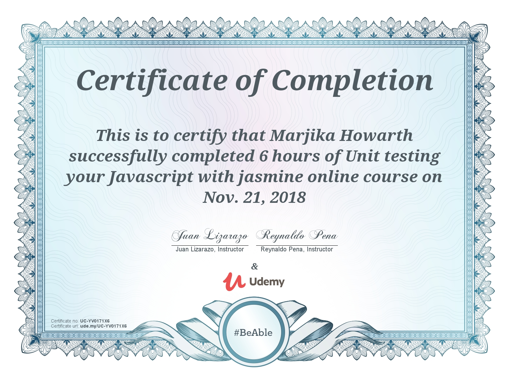

<h2>Testing with Jasmine (and Karma, etc.)</h2>

<h4>Simple Calculator</h4>

This application was created to practice writing and implementing tests with Jasmine.  The basic application is a calculator program.  The main purpose is to write tests for proactice in a Udemy Jasmine testing course.
You can try out the calculator here: https://marjika.github.io/simple-calculator/

<h4>Testing Practice</h4>

The npms for this application are all devDependencies adapted to run tests on the calculator.  NPM's include: instanbul, jasmine, karma, karma-chrome-launcher, karma-cli, karma-coverage, karma-jasmine-matcher, and puppeteer. 

<h4>Unit testing your Javascript with Jasmine</h4>

This project concludes a course taken to explore testing code with Jasmine.

